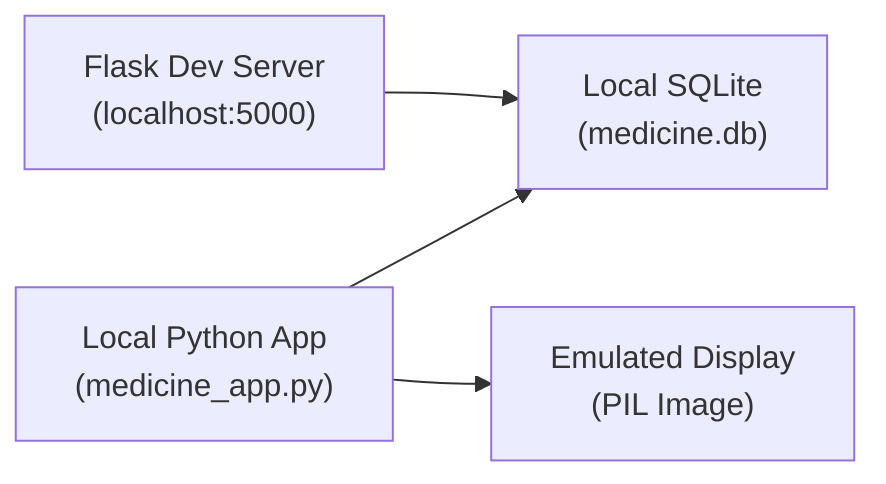
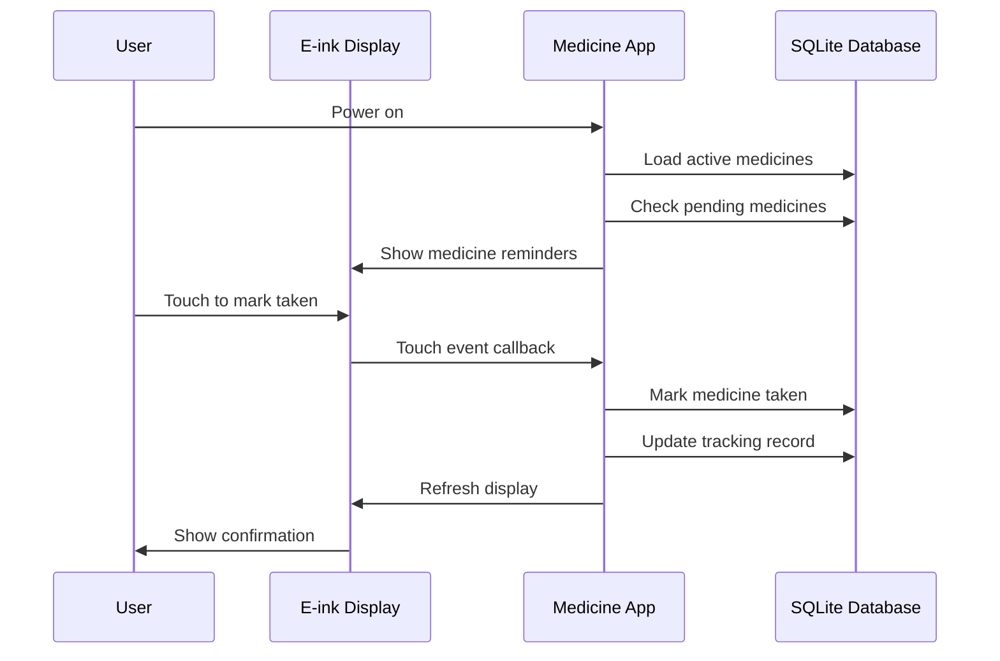
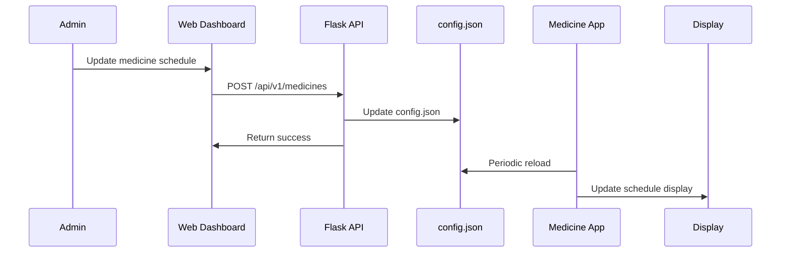

# Pi Zero 2W Medicine Tracker - System Architecture

**Version:** 2.0.0
**Last Updated:** November 8, 2025
**Author:** Pi Zero 2W Development Team

---

## Table of Contents

1. [Overview](#overview)
2. [System Architecture](#system-architecture)
3. [Core Layers](#core-layers)
4. [Technology Stack](#technology-stack)
5. [Module Structure](#module-structure)
6. [Communication Patterns](#communication-patterns)
7. [Deployment Architecture](#deployment-architecture)
8. [Design Principles](#design-principles)

---

## Overview

The Pi Zero 2W Medicine Tracker is a comprehensive medication management system designed for resource-constrained devices. It provides:

- **E-ink Display Interface**: Real-time medicine reminders and status display
- **RESTful API**: Web-based configuration and data management
- **SQLite Database**: Persistent storage with ACID compliance
- **Multiple Applications**: Specialized apps for medicine tracking, pomodoro timing, weather, flights, etc.
- **Modular Architecture**: Reusable components and shared utilities

### Key Features

- Medicine schedule management with time windows
- Adherence tracking and statistics
- Low stock monitoring
- Touch-based interaction (GT1151 capacitive touch)
- Web UI for remote configuration
- RESTful API for automation and integration

---

## System Architecture

```mermaid
graph TB
    subgraph "User Interfaces"
        EP["E-ink Display<br/>(EPD 2.13\")"]
        TOUCH["Touch Input<br/>(GT1151)"]
        WEB["Web Dashboard<br/>(Flask)"]
    end

    subgraph "Application Layer"
        MED["Medicine App"]
        POM["Pomodoro App"]
        WEATHER["Weather App"]
        DISNEY["Disney App"]
        FLIGHT["Flights App"]
        MENU["Menu System"]
    end

    subgraph "API Layer"
        FLASK["Flask Server<br/>(5000)"]
        API_V1["API v1<br/>(RESTful)"]
        ROUTES["Routes<br/>(medicines, tracking,<br/>config)"]
        SERVICES["Services Layer<br/>(business logic)"]
    end

    subgraph "Display Component Library"
        FONTS["Fonts"]
        CANVAS["Canvas"]
        SHAPES["Shapes"]
        ICONS["Icons"]
        LAYOUTS["Layouts"]
        COMPONENTS["Components"]
        TOUCH_H["Touch Handler"]
    end

    subgraph "Data Layer"
        DB["SQLite Database<br/>(medicine.db)"]
        SCHEMA["Schema<br/>(tables, views,<br/>triggers)"]
    end

    subgraph "Shared Utilities"
        CONFIG["ConfigLoader"]
        BACKUP["Backup System"]
        VALIDATION["Validation"]
        APP_UTILS["App Utils"]
    end

    EP --> CANVAS
    TOUCH --> TOUCH_H
    WEB --> FLASK

    MED --> DISPLAY_LIB["Display Library"]
    POM --> DISPLAY_LIB
    WEATHER --> DISPLAY_LIB
    DISNEY --> DISPLAY_LIB
    FLIGHT --> DISPLAY_LIB
    MENU --> DISPLAY_LIB

    MED --> DB
    API_V1 --> DB

    DISPLAY_LIB --> FONTS
    DISPLAY_LIB --> CANVAS
    DISPLAY_LIB --> SHAPES
    DISPLAY_LIB --> ICONS
    DISPLAY_LIB --> LAYOUTS
    DISPLAY_LIB --> COMPONENTS
    DISPLAY_LIB --> TOUCH_H

    FLASK --> ROUTES
    ROUTES --> SERVICES
    SERVICES --> DB

    APP_UTILS --> CONFIG
    APP_UTILS --> BACKUP
    APP_UTILS --> VALIDATION

    MED --> APP_UTILS
    POM --> APP_UTILS
    WEATHER --> APP_UTILS

    SCHEMA --> DB
    TOUCH_H --> TOUCH
```

---

## Core Layers

### 1. Presentation Layer

The presentation layer consists of:

#### E-ink Display (`display/`)
- **Canvas Module** (`canvas.py`): Abstraction for PIL Image creation and management
- **Touch Handler** (`touch_handler.py`): Thread-safe GT1151 touch input handling
- **Fonts** (`fonts.py`): Font caching and preset system
- **Shapes** (`shapes.py`): Primitive shape drawing utilities
- **Text** (`text.py`): Text rendering, wrapping, and centering
- **Icons** (`icons.py`): Icon library for pills, food, weather, compass, etc.
- **Layouts** (`layouts.py`): Page layout components (header, footer, split views)
- **Components** (`components.py`): Composite UI components (status bar, progress bar, buttons)

#### Web Interface (`web_config.py`)
- Flask-based web dashboard for configuration
- REST API proxy for remote management
- Interactive UI for medicine management

### 2. Application Layer

#### Core Applications

```
medicine_app.py       - Medicine tracker with adherence monitoring
pomodoro_app.py      - Pomodoro timer with break reminders
weather_cal_app.py   - Weather and calendar display
flights_app.py       - Flight status monitoring
disney_app.py        - Disney park wait times
mbta_app.py          - Boston transit information
forbidden_app.py     - Forbidden mountain display
reboot_app.py        - System reboot utility
menu_system.py       - App menu and launcher
```

Each application:
- Imports shared utilities and display library
- Implements event loop with periodic updates
- Handles touch input through `TouchHandler`
- Uses signal handlers for graceful shutdown
- Manages display rendering (full/partial refresh)

### 3. API Layer (`api/`)

```
api/
├── __init__.py           - Flask app factory
├── config.py             - Configuration management
├── v1/                   - API v1 namespace
│   ├── __init__.py       - Blueprint definition
│   ├── routes/           - Endpoint implementations
│   │   ├── medicines.py  - Medicine CRUD operations
│   │   ├── tracking.py   - Adherence tracking endpoints
│   │   └── config.py     - Configuration management
│   ├── services/         - Business logic layer
│   ├── middleware/       - Request/response processing
│   └── serializers/      - Data serialization
```

#### Key Endpoints

**Medicines**
- `GET /api/v1/medicines` - List all medicines
- `POST /api/v1/medicines` - Create medicine
- `GET /api/v1/medicines/{id}` - Get medicine details
- `PUT /api/v1/medicines/{id}` - Update medicine
- `DELETE /api/v1/medicines/{id}` - Delete medicine
- `GET /api/v1/medicines/pending` - Get pending medicines
- `GET /api/v1/medicines/low-stock` - Get low stock alerts

**Tracking**
- `GET /api/v1/tracking` - Get tracking records
- `POST /api/v1/tracking` - Mark medicines taken
- `GET /api/v1/tracking/today` - Today's statistics

**Configuration**
- `GET /api/v1/config` - Get all configuration
- `PUT /api/v1/config` - Update configuration
- `GET /api/v1/config/{section}` - Get section config
- `PATCH /api/v1/config/{section}` - Update section

### 4. Data Layer (`db/`)

```
db/
├── medicine_db.py  - Database abstraction layer (DAL)
└── schema.sql      - Database schema definition
```

#### Database Components

**Tables**
- `medicines` - Medicine definitions with schedules
- `medicine_days` - Many-to-many relationship (medicines ↔ days)
- `tracking` - Adherence records (taken/skipped)
- `time_windows` - Predefined time window definitions
- `metadata` - System metadata and versioning

**Views**
- `v_medicines_with_days` - Medicines with scheduled days
- `v_today_stats` - Daily adherence statistics
- `v_low_stock_medicines` - Low stock alerts

**Features**
- Full transaction support with rollback
- Foreign key constraints
- Automatic timestamp management via triggers
- Compound indexes for performance
- WAL (Write-Ahead Logging) mode for concurrency

### 5. Shared Utilities (`shared/`)

```
shared/
├── app_utils.py    - Common application utilities
├── validation.py   - Input validation and schemas
└── backup.py       - Database backup and migration
```

#### Key Utilities

**ConfigLoader** (`app_utils.py`)
- Loads JSON configuration files
- Provides section-based access
- Automatic environment variable substitution

**TouchHandler** (`display/touch_handler.py`)
- Thread-safe touch event handling
- Configurable event types (press, release, move)
- Callback-based event dispatch

**Signal Handlers** (`app_utils.py`)
- Graceful shutdown on SIGTERM/SIGINT
- Cleanup of display and touch resources
- Exception handling

**Backup System** (`shared/backup.py`)
- Automatic database backups
- Migration support (JSON → SQLite)
- Timestamped backup files

---

## Technology Stack

### Hardware
- **Processor**: ARM Cortex-A53 (Pi Zero 2W)
- **Display**: E-ink 2.13" (EPD 2.13 V3)
- **Touch**: Capacitive GT1151
- **Storage**: microSD card (SQLite database)

### Software
- **Language**: Python 3.7+
- **Display**: PIL/Pillow
- **Database**: SQLite 3.x
- **Web Framework**: Flask + Flask-CORS
- **HTTP**: RESTful API with JSON
- **Configuration**: JSON format

### Libraries

```
TP_lib          - Touch panel and display drivers
PIL/Pillow      - Image manipulation
Flask           - Web framework
Flask-CORS      - Cross-origin support
sqlite3         - Database driver (stdlib)
threading       - Multi-threading support
signal          - Signal handling
logging         - Logging framework
```

---

## Module Structure

### Display Module Hierarchy

```
display/
├── __init__.py           - Module exports
├── fonts.py
│   ├── get_font()
│   ├── get_font_preset()
│   └── clear_font_cache()
├── canvas.py
│   ├── create_canvas()
│   └── Canvas class
├── shapes.py
│   ├── draw_line()
│   ├── draw_rectangle()
│   ├── draw_circle()
│   └── helper functions
├── text.py
│   ├── draw_centered_text()
│   ├── draw_wrapped_text()
│   ├── truncate_text()
│   └── get_text_size()
├── icons.py
│   ├── draw_pill_icon()
│   ├── draw_food_icon()
│   ├── draw_weather_icon()
│   └── other icon functions
├── layouts.py
│   ├── HeaderLayout
│   ├── FooterLayout
│   ├── SplitLayout
│   └── ListLayout
├── components.py
│   ├── StatusBar
│   ├── ProgressBar
│   ├── Button
│   └── Dialog
└── touch_handler.py
    ├── TouchHandler class
    ├── Event callbacks
    └── Thread management
```

### Database Module Structure

```
db/
├── medicine_db.py
│   ├── MedicineDatabase class
│   ├── Connection management
│   ├── Transaction handling
│   ├── CRUD operations
│   ├── Query methods
│   └── Bulk operations
└── schema.sql
    ├── Table definitions
    ├── Indexes
    ├── Triggers
    ├── Views
    └── Constraints
```

### Shared Utilities Structure

```
shared/
├── app_utils.py
│   ├── Path management
│   ├── Logging setup
│   ├── ConfigLoader class
│   ├── TouchHandler (legacy)
│   ├── PeriodicTimer
│   ├── Signal handlers
│   ├── Display initialization
│   └── Cleanup functions
├── validation.py
│   ├── Schema definitions
│   ├── Validation functions
│   └── Error classes
└── backup.py
    ├── Backup creation
    ├── Backup restoration
    └── JSON to SQLite migration
```

---

## Communication Patterns

### 1. Application → Database

**Direct Access Pattern**
```python
from db.medicine_db import MedicineDatabase

db = MedicineDatabase()
medicines = db.get_all_medicines()
```

**Transaction Pattern**
```python
with db.transaction() as conn:
    cursor = conn.execute(sql)
    # Auto-commit on success, rollback on exception
```

### 2. API → Database

**Service Layer Pattern**
```
Route Handler
    ↓
Serializer (validate input)
    ↓
Service (business logic)
    ↓
Database Layer (data access)
    ↓
SQLite (persistence)
```

### 3. Display → Input

**Touch Event Pattern**
```
TouchHandler (poll GT1151)
    ↓
Detect event (press/release/move)
    ↓
Invoke registered callback
    ↓
Application processes event
```

### 4. Configuration Propagation

**Config Hierarchy**
```
config.json (on disk)
    ↓
ConfigLoader (in memory)
    ↓
Loaded on app startup
    ↓
API endpoints for updates
    ↓
Persisted to disk
```

---

## Deployment Architecture

### Development Environment



### Production Environment (Pi Zero 2W)

```mermaid
graph TB
    subgraph "Pi Zero 2W Hardware"
        CPU["ARM CPU"]
        GPIO["GPIO Pins"]
        MEM["512MB RAM"]
        STORAGE["microSD Card<br/>(32GB+)"]
    end

    subgraph "Display Stack"
        EPD["E-ink Display<br/>(2.13\")"]
        GT1151["GT1151 Touch<br/>Controller"]
    end

    subgraph "Software Stack"
        APPS["Applications<br/>(medicine, pomodoro,<br/>weather, etc.)"]
        API["Flask API<br/>(:5000)"]
        DB["SQLite Database<br/>(medicine.db)"]
        CONFIG["Config File<br/>(config.json)"]
    end

    subgraph "Network"
        WIFI["WiFi Module<br/>(USB-C)"]
        ETHERNET["Ethernet<br/>(USB-C)"]
    end

    CPU --> APPS
    CPU --> API
    CPU --> GPIO
    GPIO --> EPD
    GPIO --> GT1151
    MEM --> APPS
    MEM --> API
    STORAGE --> DB
    STORAGE --> CONFIG
    STORAGE --> APPS
    WIFI --> ETHERNET
    APPS --> DB
    APPS --> EPD
    API --> DB
    API --> CONFIG
```

### Service Architecture

```
systemd service: pizero-webui.service
    ├── Runs web_config.py
    ├── Port 8000 (web dashboard)
    └── Auto-restart on failure

Cron/systemd-timer
    ├── Medicine reminders (medicine_app.py)
    ├── Periodic API health checks
    └── Database maintenance (VACUUM, ANALYZE)
```

---

## Design Principles

### 1. **Modularity**
- Components are independent and reusable
- Clear interfaces between layers
- Minimal coupling between modules

### 2. **DRY (Don't Repeat Yourself)**
- Display library eliminates duplication
- Shared utilities for common patterns
- Configuration management centralized

### 3. **SOLID Principles**

**Single Responsibility**
- Each module has one reason to change
- Database layer handles only persistence
- Display library only renders

**Open/Closed**
- New apps can extend display components
- API routes easily extensible
- Database queries composable

**Liskov Substitution**
- Components follow consistent interfaces
- Serializers are interchangeable
- Database connections are fungible

**Interface Segregation**
- Apps only import needed utilities
- API endpoints focused on single resource
- Database queries are specific

**Dependency Inversion**
- Apps depend on abstractions (ConfigLoader, MedicineDatabase)
- Not on concrete implementations
- Allows easy testing and mocking

### 4. **Testability**
- Components can be unit tested in isolation
- Mock database available for testing
- Display rendering verifiable without hardware
- API endpoints testable via Flask test client

### 5. **Performance**
- Font caching prevents repeated disk access
- Database indexes on common queries
- Partial display refresh reduces power consumption
- WAL mode for better concurrency
- Thread-local database connections

### 6. **Reliability**
- Transaction support with rollback
- Foreign key constraints enforced
- Graceful shutdown handling
- Backup system for data protection
- Error logging throughout

### 7. **Maintainability**
- Clear code documentation
- Consistent naming conventions
- Logging for debugging
- Modular test organization
- API versioning for compatibility

---

## Data Flow

### Medicine Tracking Flow



### API Configuration Flow



---

## Future Enhancements

### Short Term
- OpenAPI/Swagger documentation
- WebSocket support for real-time updates
- Enhanced error recovery
- Performance metrics collection

### Medium Term
- Multi-user support with authentication
- Cloud synchronization
- Advanced scheduling (every N days, etc.)
- Integration with calendar systems

### Long Term
- Mobile app for iOS/Android
- Smart device integration (Alexa, Google Home)
- Machine learning for adherence prediction
- Telemedicine integration

---

## File Structure Reference

See `/docs/COMPONENT_DIAGRAM.md` for detailed component relationships.
See `/docs/DATABASE_SCHEMA.md` for database structure details.
See `/docs/DATA_FLOW.md` for detailed data flow diagrams.

---

## Conclusion

The Pi Zero 2W Medicine Tracker employs a layered, modular architecture that:

1. **Separates concerns** between presentation, application, API, and data layers
2. **Promotes reuse** through shared components and utilities
3. **Ensures reliability** through transactions, validation, and error handling
4. **Maintains scalability** through proper abstraction and APIs
5. **Enables testing** through dependency injection and mocking

This design allows for:
- Easy addition of new applications
- Simple extension of API capabilities
- Straightforward testing and debugging
- Efficient resource usage on constrained hardware
- Graceful degradation on failure

---

**For detailed information:**
- Architecture diagrams: See Mermaid diagrams throughout this document
- Database schema: See `/docs/DATABASE_SCHEMA.md`
- Component relationships: See `/docs/COMPONENT_DIAGRAM.md`
- Data flows: See `/docs/DATA_FLOW.md`
- API endpoints: See `/docs/API_DESIGN.md`
- Deployment: See `/docs/DEPLOYMENT_GUIDE.md`
