# Pi Zero 2W Medicine Tracker - Component Interactions

**Version:** 2.0.0
**Last Updated:** November 8, 2025

---

## Table of Contents

1. [Component Overview](#component-overview)
2. [Core Component Relationships](#core-component-relationships)
3. [Display Component Hierarchy](#display-component-hierarchy)
4. [API Component Architecture](#api-component-architecture)
5. [Data Flow Between Components](#data-flow-between-components)
6. [Application Integration](#application-integration)
7. [Dependency Graph](#dependency-graph)
8. [Component Interaction Examples](#component-interaction-examples)

---

## Component Overview

The system is composed of several interconnected components organized in layers:

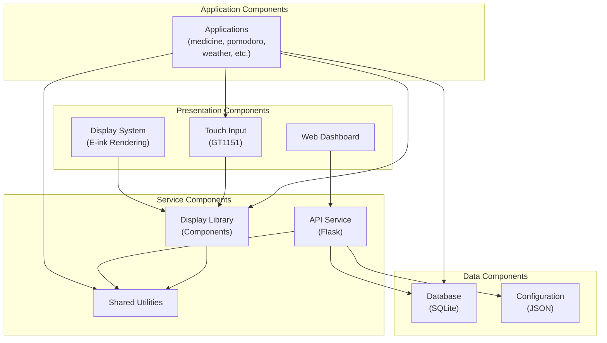

---

## Core Component Relationships

### 1. Display Library Components

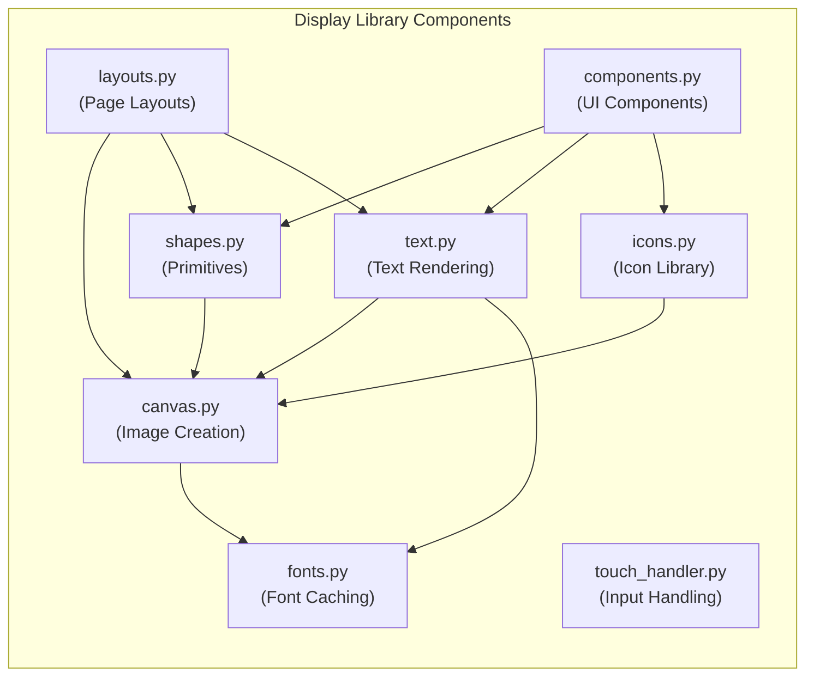

**Relationships**:
- **FONTS** (base): Loads and caches fonts for other components
- **CANVAS** (foundation): Creates PIL Image/ImageDraw objects
- **SHAPES** (uses Canvas): Draws lines, rectangles, circles
- **TEXT** (uses Canvas, Fonts): Renders text with sizing/wrapping
- **ICONS** (uses Canvas): Draws icons from library
- **LAYOUTS** (uses Shapes, Text): Positions content on page
- **COMPONENTS** (uses Shapes, Text, Icons): Complex UI elements
- **TOUCH** (independent): Handles GT1151 touch input asynchronously

---

### 2. Database Component Architecture

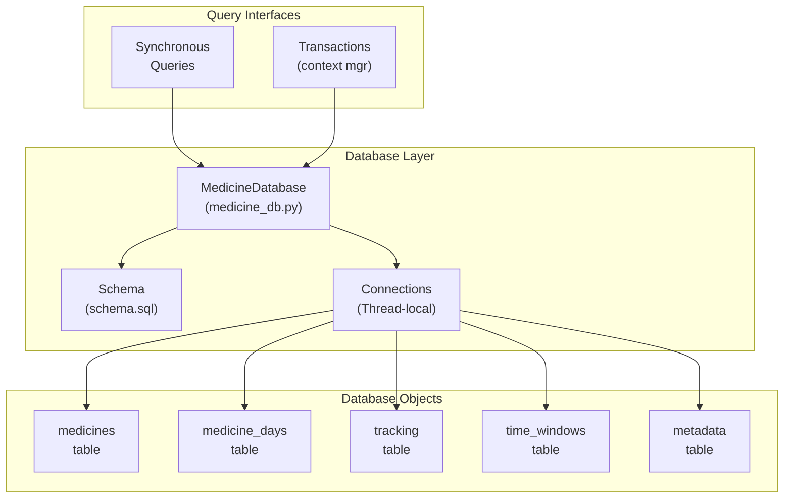

**Relationships**:
- **MedicineDatabase**: Main interface, connection management
- **Connections**: Thread-local SQLite connections with WAL mode
- **Schema**: SQL table definitions, indexes, triggers, views
- **Medicines**: Core medicine definitions
- **Medicine_Days**: M2M relationship for scheduling
- **Tracking**: Adherence records
- **Time_Windows**: Predefined time slots
- **Metadata**: Schema versioning and timestamps

---

### 3. API Component Stack

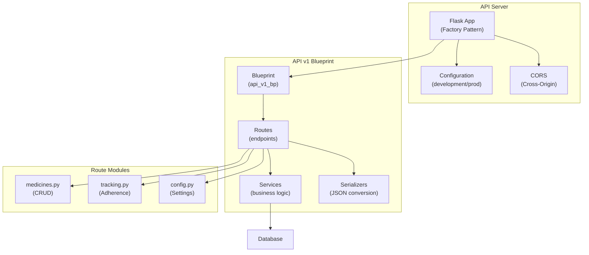

**Relationships**:
- **Flask**: WSGI server, request routing, error handling
- **Configuration**: Environment-specific settings
- **Blueprint**: Namespace for v1 API endpoints
- **Routes**: Request handlers, validation, response formatting
- **Services**: Business logic, database queries, calculations
- **Serializers**: JSON encoding/decoding, data transformation
- **Route Modules**: Specific resource implementations

---

## Display Component Hierarchy

### Component Dependency Tree

```
display/
├── fonts.py
│   └── Singleton Font Cache
│       ├── get_font(path, size)
│       ├── get_font_preset(name)
│       └── clear_font_cache()
│
├── canvas.py
│   └── Canvas Abstraction
│       ├── create_canvas(width=250, height=122)
│       └── Canvas class
│
├── shapes.py (depends: canvas)
│   ├── draw_line(draw, x0, y0, x1, y1, ...)
│   ├── draw_rectangle(draw, x, y, w, h, ...)
│   ├── draw_circle(draw, x, y, r, ...)
│   ├── draw_horizontal_line(...)
│   └── draw_vertical_line(...)
│
├── text.py (depends: canvas, fonts)
│   ├── draw_centered_text(draw, text, y, ...)
│   ├── draw_wrapped_text(draw, text, x, y, ...)
│   ├── truncate_text(text, max_width, ...)
│   └── get_text_size(text, font)
│
├── icons.py (depends: canvas)
│   ├── draw_pill_icon(draw, x, y, ...)
│   ├── draw_food_icon(draw, x, y, ...)
│   ├── draw_weather_icon(draw, x, y, ...)
│   ├── draw_compass_icon(draw, x, y, ...)
│   └── other icon functions
│
├── layouts.py (depends: shapes, text, canvas)
│   ├── HeaderLayout
│   │   └── draw(draw)
│   ├── FooterLayout
│   │   └── draw(draw)
│   ├── SplitLayout
│   │   └── draw(draw)
│   └── ListLayout
│       └── draw(draw)
│
├── components.py (depends: shapes, text, icons)
│   ├── StatusBar
│   │   └── draw(draw, status, ...)
│   ├── ProgressBar
│   │   └── draw(draw, current, total, ...)
│   ├── Button
│   │   └── draw(draw, text, x, y, ...)
│   └── Dialog
│       └── draw(draw, title, message, ...)
│
└── touch_handler.py (independent)
    ├── TouchHandler class
    ├── Event types (press, release, move)
    ├── Callback registration
    └── Thread management
```

### Component Usage Patterns

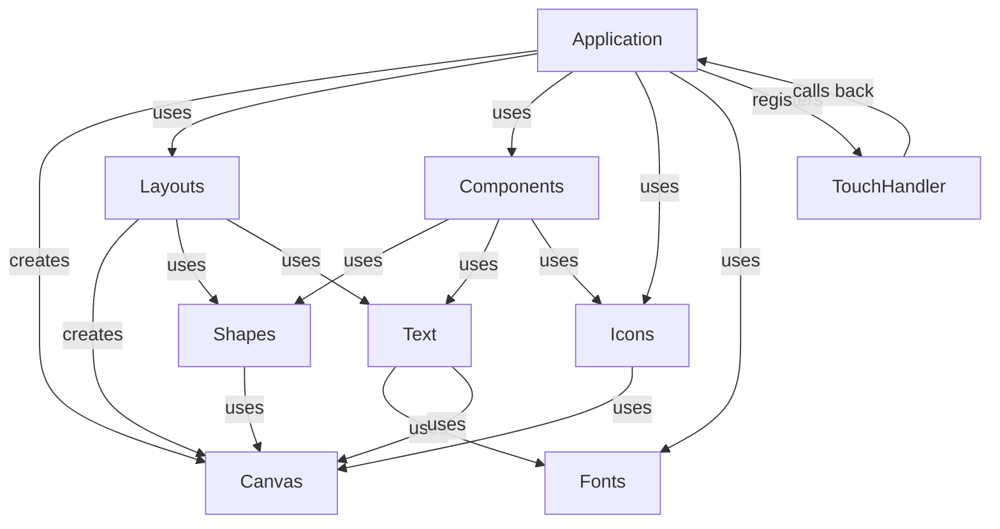

---

## API Component Architecture

### Request/Response Flow

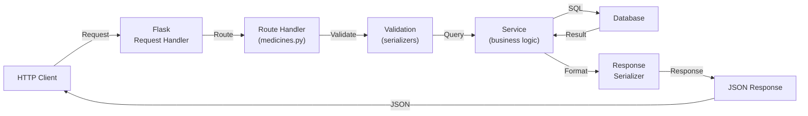

### API Route Organization

```
/api/v1/
├── medicines
│   ├── GET / (list all)
│   ├── POST / (create)
│   ├── GET /{id} (get one)
│   ├── PUT /{id} (update)
│   ├── DELETE /{id} (delete)
│   ├── GET /pending (pending medicines)
│   ├── GET /low-stock (low stock alerts)
│   └── POST /{id}/tracking (mark taken)
├── tracking
│   ├── GET / (list records)
│   ├── POST / (batch mark)
│   └── GET /today (today's stats)
└── config
    ├── GET / (all config)
    ├── PUT / (update all)
    ├── GET /{section} (get section)
    └── PATCH /{section} (update section)
```

---

## Data Flow Between Components

### Application → Display → Hardware

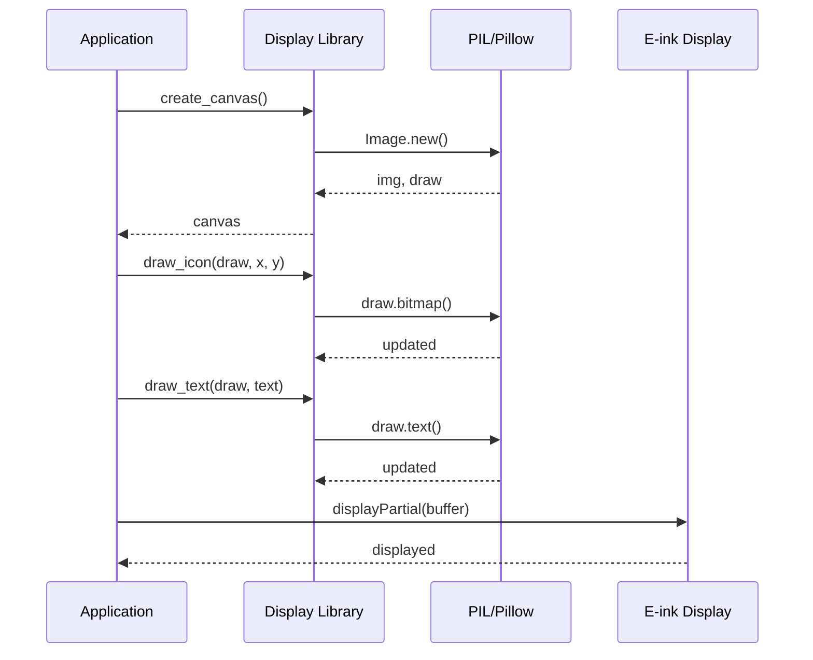

### Application → Database → Storage

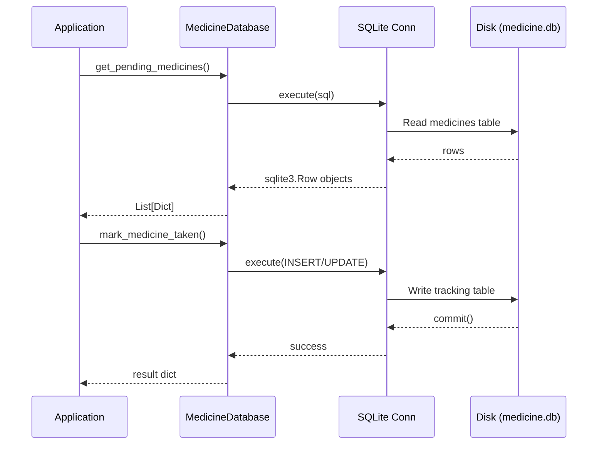

### API Server → Database → File

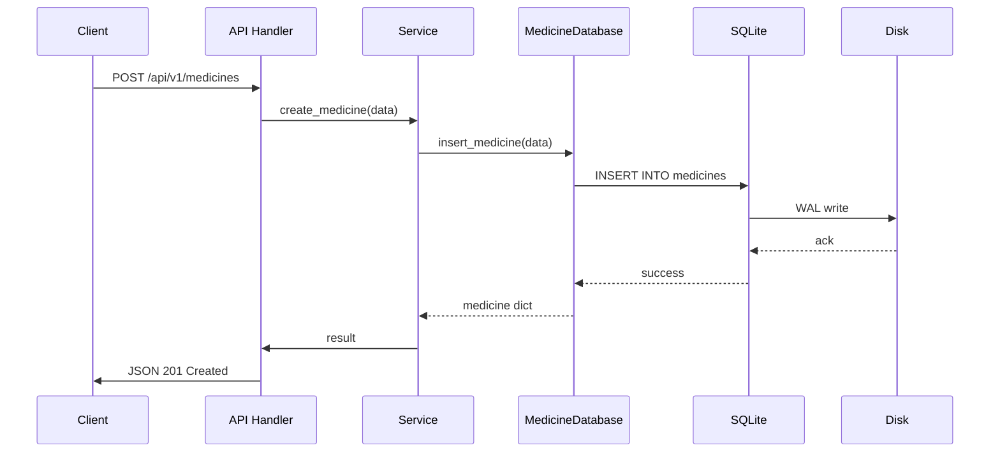

---

## Application Integration

### Medicine App Integration

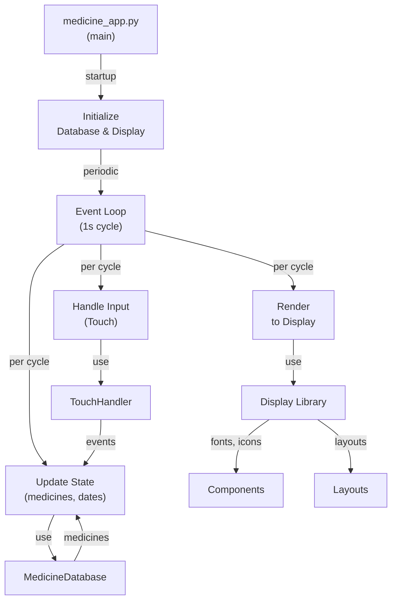

### Pomodoro App Integration

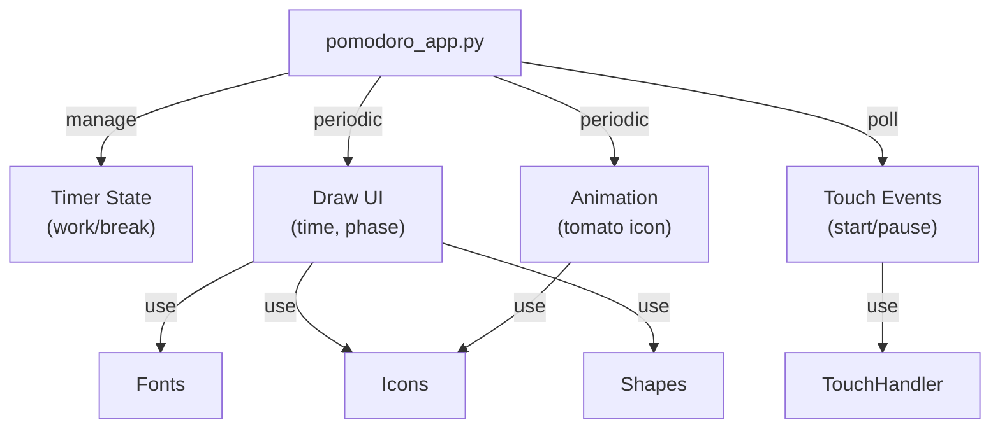

---

## Dependency Graph

### Top-Level Dependencies

```
medicine_app.py
├── db.medicine_db (database operations)
├── shared.app_utils (utilities, config)
├── display (rendering)
│   ├── fonts
│   ├── canvas
│   ├── shapes
│   ├── text
│   ├── icons
│   ├── layouts
│   ├── components
│   └── touch_handler
├── TP_lib (hardware drivers)
└── PIL (image manipulation)

api/__init__.py
├── flask (web framework)
├── flask_cors
├── api.config (configuration)
├── api.v1 (blueprint)
│   ├── routes.medicines
│   ├── routes.tracking
│   ├── routes.config
│   ├── services.* (business logic)
│   └── serializers.* (JSON)
├── db.medicine_db
└── shared.* (utilities)

pomodoro_app.py
├── shared.app_utils
├── display.*
├── TP_lib
└── PIL

web_config.py
├── flask
├── json
└── os/sys
```

### Circular Dependency Analysis

**Result**: No circular dependencies detected

**Key principle**: Unidirectional dependency flow
- Applications → Libraries
- API → Database
- Display → Fonts (caching)
- No reverse dependencies

---

## Component Interaction Examples

### Example 1: Display a Medicine Reminder

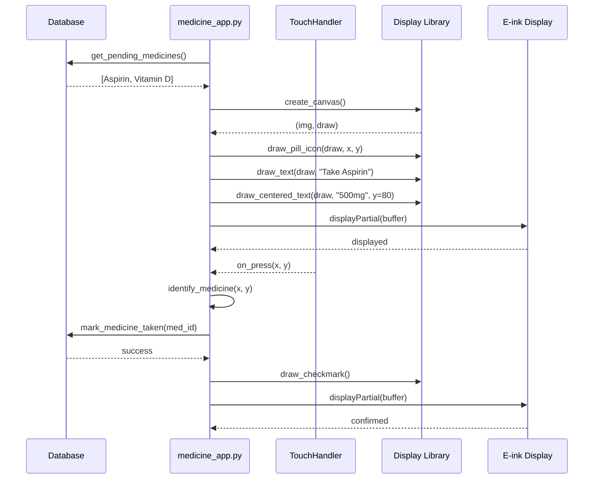

### Example 2: Update Medicine via API

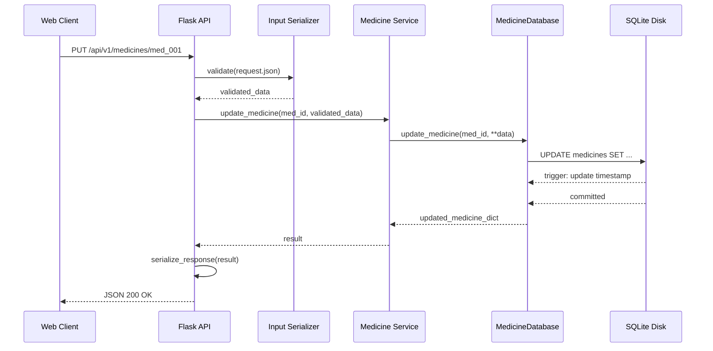

### Example 3: Get Daily Adherence Stats

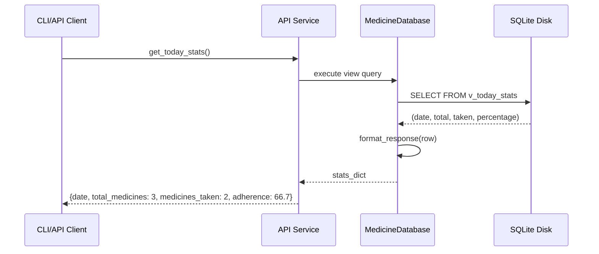

---

## Component Communication Protocols

### 1. Synchronous Request/Response

**Used by**: Applications ↔ Database, API ↔ Database

```python
# Application requests data
medicines = db.get_pending_medicines()
# Blocks until response received
```

### 2. Asynchronous Event Handling

**Used by**: TouchHandler → Application callbacks

```python
def on_touch(x, y):
    # Non-blocking callback
    process_touch_event(x, y)

handler.register_press_callback(on_touch)
# Callback invoked asynchronously in separate thread
```

### 3. Configuration-based

**Used by**: Applications ↔ ConfigLoader

```python
config = ConfigLoader()
update_interval = config.get_section('medicine').get('update_interval', 60)
# Reads once on startup, no real-time updates
```

### 4. REST API

**Used by**: Web Clients ↔ Flask API

```
GET /api/v1/medicines
Content-Type: application/json

HTTP/1.1 200 OK
Content-Type: application/json

{
    "success": true,
    "data": [...],
    "meta": {"timestamp": "2025-11-08T..."}
}
```

---

## Component Testing

### Isolated Component Testing

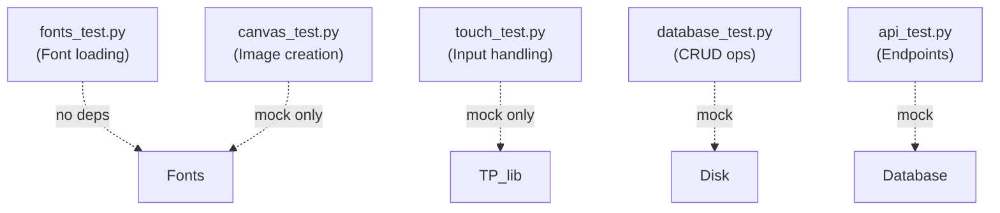

### Integration Testing

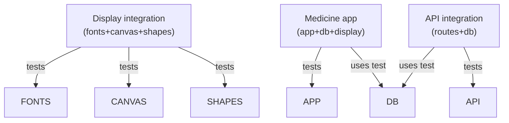

---

## Performance Characteristics

### Component Latency

| Component | Operation | Latency | Notes |
|-----------|-----------|---------|-------|
| Fonts | Load/cache | 10-50ms | Disk I/O, first load only |
| Fonts | Render text | 1-5ms | In-memory, rapid |
| Canvas | Create | <1ms | Memory allocation |
| Icons | Draw | <1ms | Pre-computed bitmaps |
| TouchHandler | Detect event | 10-100ms | Polling interval |
| Database | Simple query | 1-10ms | Cached, indexed |
| Database | Complex query | 10-100ms | Join, group by |
| API | Request/response | 50-200ms | I/O + processing |

### Memory Usage

| Component | Memory | Notes |
|-----------|--------|-------|
| Canvas (250x122) | ~30KB | PIL Image + ImageDraw |
| Font cache (10 fonts) | ~5MB | Loaded in RAM |
| TouchHandler | <1MB | Event queue + callbacks |
| MedicineDatabase | <5MB | Connection + statement cache |
| Flask app | ~20MB | With all routes loaded |

---

## Summary

The component architecture achieves:

1. **Modularity**: Each component has clear responsibilities
2. **Reusability**: Display library used by multiple apps
3. **Testability**: Components can be tested in isolation
4. **Maintainability**: Clear dependencies and communication paths
5. **Scalability**: New components easily added without breaking changes
6. **Performance**: Optimized data flows and caching strategies

---

**See Also**:
- `/docs/ARCHITECTURE.md` - System-level architecture
- `/docs/DATABASE_SCHEMA.md` - Database design
- `/docs/DATA_FLOW.md` - Data movement through system
- Source code in `/display/`, `/api/`, `/db/`, `/shared/`
