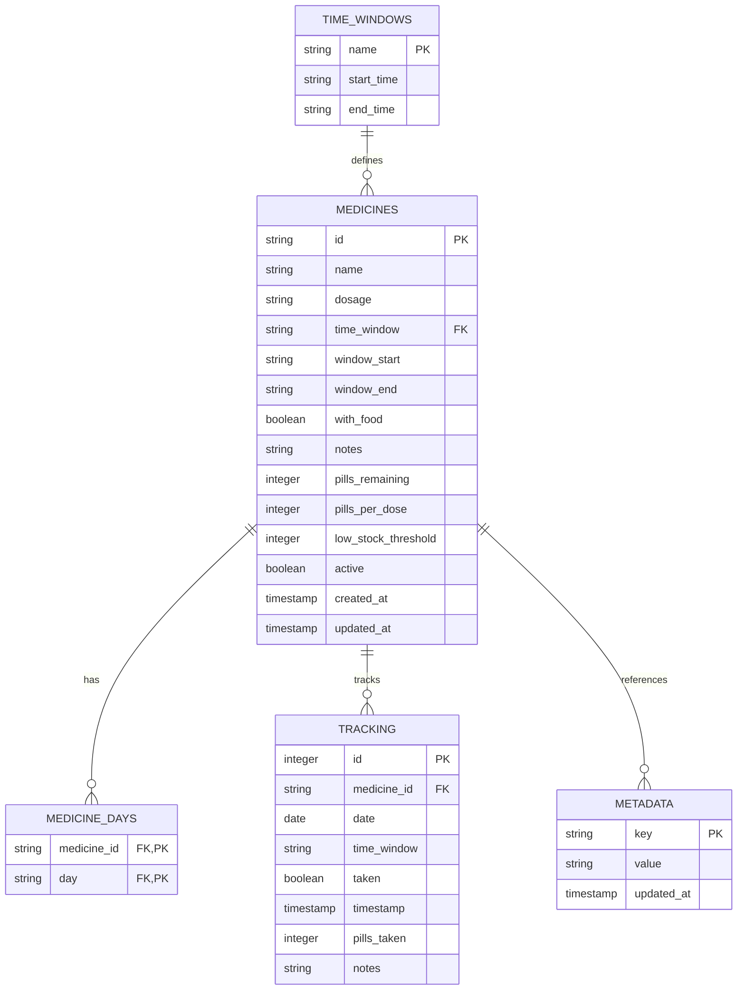

# Pi Zero 2W Medicine Tracker - Database Schema Documentation

**Version:** 2.0.0
**Database Engine:** SQLite 3.x
**Last Updated:** November 8, 2025

---

## Table of Contents

1. [Database Overview](#database-overview)
2. [Schema Diagram](#schema-diagram)
3. [Table Specifications](#table-specifications)
4. [Views](#views)
5. [Triggers](#triggers)
6. [Indexes](#indexes)
7. [Constraints](#constraints)
8. [Data Types](#data-types)
9. [Example Queries](#example-queries)
10. [Maintenance](#maintenance)

---

## Database Overview

### Purpose
The medicine tracker database stores:
- Medicine definitions and configurations
- Medicine scheduling information (days of week, time windows)
- Adherence tracking records
- System metadata and versioning

### Characteristics
- **Type**: SQLite 3.x (serverless, file-based)
- **Location**: `/home/pizero2w/pizero_apps/medicine.db`
- **Mode**: WAL (Write-Ahead Logging) for concurrent access
- **Foreign Keys**: Enabled for referential integrity
- **Transactions**: ACID-compliant with rollback support

### Database Initialization

```python
from db.medicine_db import MedicineDatabase

# Automatic schema creation on first use
db = MedicineDatabase()
# If database doesn't exist, schema.sql is executed
# If exists, schema_version is verified
```

---

## Schema Diagram



---

## Table Specifications

### 1. MEDICINES Table

**Purpose**: Stores medicine/vitamin definitions with configuration

**Schema**:
```sql
CREATE TABLE medicines (
    id TEXT PRIMARY KEY,
    name TEXT NOT NULL,
    dosage TEXT NOT NULL,
    time_window TEXT NOT NULL CHECK(time_window IN ('morning', 'afternoon', 'evening', 'night')),
    window_start TEXT NOT NULL,
    window_end TEXT NOT NULL,
    with_food BOOLEAN NOT NULL DEFAULT 0,
    notes TEXT,
    pills_remaining INTEGER NOT NULL DEFAULT 0 CHECK(pills_remaining >= 0),
    pills_per_dose INTEGER NOT NULL DEFAULT 1 CHECK(pills_per_dose > 0),
    low_stock_threshold INTEGER NOT NULL DEFAULT 10 CHECK(low_stock_threshold > 0),
    active BOOLEAN NOT NULL DEFAULT 1,
    created_at TIMESTAMP DEFAULT CURRENT_TIMESTAMP,
    updated_at TIMESTAMP DEFAULT CURRENT_TIMESTAMP
);
```

**Columns**:

| Column | Type | Constraints | Description |
|--------|------|-------------|-------------|
| `id` | TEXT | PRIMARY KEY | Unique medicine identifier (UUID) |
| `name` | TEXT | NOT NULL | Medicine/vitamin name (e.g., "Aspirin") |
| `dosage` | TEXT | NOT NULL | Dosage description (e.g., "500mg") |
| `time_window` | TEXT | NOT NULL, CHECK IN | Scheduled time (morning/afternoon/evening/night) |
| `window_start` | TEXT | NOT NULL | Start time (HH:MM format, e.g., "06:00") |
| `window_end` | TEXT | NOT NULL | End time (HH:MM format, e.g., "12:00") |
| `with_food` | BOOLEAN | NOT NULL, DEFAULT 0 | Must be taken with food (0=false, 1=true) |
| `notes` | TEXT | NULL | Additional notes or warnings |
| `pills_remaining` | INTEGER | NOT NULL, DEFAULT 0 | Current pill count (inventory) |
| `pills_per_dose` | INTEGER | NOT NULL, DEFAULT 1 | Pills taken per dose |
| `low_stock_threshold` | INTEGER | NOT NULL, DEFAULT 10 | Alert when pills fall below this |
| `active` | BOOLEAN | NOT NULL, DEFAULT 1 | Whether medicine is currently active |
| `created_at` | TIMESTAMP | DEFAULT CURRENT_TIMESTAMP | Creation timestamp |
| `updated_at` | TIMESTAMP | DEFAULT CURRENT_TIMESTAMP | Last modification timestamp |

**Indexes**:
- `idx_medicines_active` - On `(active)` where `active = 1` - For quick filtering of active medicines
- `idx_medicines_time_window` - On `(time_window)` - For time-based queries

**Example Records**:
```
id: med_001_aspirin
name: Aspirin
dosage: 500mg
time_window: morning
window_start: 06:00
window_end: 12:00
with_food: 1
pills_remaining: 45
pills_per_dose: 1
low_stock_threshold: 10
active: 1

id: med_002_vitamin_d
name: Vitamin D
dosage: 2000IU
time_window: morning
window_start: 06:00
window_end: 12:00
with_food: 0
pills_remaining: 3
pills_per_dose: 1
low_stock_threshold: 10
active: 1
```

---

### 2. MEDICINE_DAYS Table

**Purpose**: Many-to-many relationship between medicines and days of week

**Schema**:
```sql
CREATE TABLE medicine_days (
    medicine_id TEXT NOT NULL,
    day TEXT NOT NULL CHECK(day IN ('mon', 'tue', 'wed', 'thu', 'fri', 'sat', 'sun')),
    PRIMARY KEY (medicine_id, day),
    FOREIGN KEY (medicine_id) REFERENCES medicines(id) ON DELETE CASCADE
);
```

**Columns**:

| Column | Type | Constraints | Description |
|--------|------|-------------|-------------|
| `medicine_id` | TEXT | NOT NULL, FK, PK | Reference to medicines.id |
| `day` | TEXT | NOT NULL, CHECK IN, PK | Day of week (3-letter abbrev) |

**Days of Week**:
- `mon` - Monday
- `tue` - Tuesday
- `wed` - Wednesday
- `thu` - Thursday
- `fri` - Friday
- `sat` - Saturday
- `sun` - Sunday

**Indexes**:
- `idx_medicine_days_day` - On `(day)` - For queries by day of week

**Example Records**:
```
medicine_id: med_001_aspirin, day: mon
medicine_id: med_001_aspirin, day: wed
medicine_id: med_001_aspirin, day: fri
medicine_id: med_002_vitamin_d, day: mon
medicine_id: med_002_vitamin_d, day: tue
medicine_id: med_002_vitamin_d, day: wed
medicine_id: med_002_vitamin_d, day: thu
medicine_id: med_002_vitamin_d, day: fri
medicine_id: med_002_vitamin_d, day: sat
medicine_id: med_002_vitamin_d, day: sun
```

**Use Case**:
- Medicine 001 (Aspirin): Monday, Wednesday, Friday
- Medicine 002 (Vitamin D): Daily except no specific days shown

---

### 3. TRACKING Table

**Purpose**: Records when medicines were taken or skipped (adherence tracking)

**Schema**:
```sql
CREATE TABLE tracking (
    id INTEGER PRIMARY KEY AUTOINCREMENT,
    medicine_id TEXT NOT NULL,
    date DATE NOT NULL,
    time_window TEXT NOT NULL,
    taken BOOLEAN NOT NULL DEFAULT 0,
    timestamp TIMESTAMP NOT NULL,
    pills_taken INTEGER NOT NULL DEFAULT 1,
    notes TEXT,
    FOREIGN KEY (medicine_id) REFERENCES medicines(id) ON DELETE CASCADE,
    UNIQUE(medicine_id, date, time_window)
);
```

**Columns**:

| Column | Type | Constraints | Description |
|--------|------|-------------|-------------|
| `id` | INTEGER | PRIMARY KEY, AUTOINCREMENT | Unique tracking record ID |
| `medicine_id` | TEXT | NOT NULL, FK | Reference to medicines.id |
| `date` | DATE | NOT NULL | Date the medicine was scheduled (YYYY-MM-DD) |
| `time_window` | TEXT | NOT NULL | Time window (morning/afternoon/evening/night) |
| `taken` | BOOLEAN | NOT NULL, DEFAULT 0 | Whether medicine was taken (0=skipped, 1=taken) |
| `timestamp` | TIMESTAMP | NOT NULL | Exact time the medicine was marked (ISO 8601) |
| `pills_taken` | INTEGER | NOT NULL, DEFAULT 1 | Number of pills actually taken |
| `notes` | TEXT | NULL | Additional notes (e.g., "missed due to travel") |

**Constraints**:
- Unique constraint on `(medicine_id, date, time_window)` - Prevents duplicate tracking records

**Indexes**:
- `idx_tracking_date` - On `(date DESC)` - For date-based queries (recent first)
- `idx_tracking_medicine` - On `(medicine_id)` - For medicine history
- `idx_tracking_date_medicine` - On `(date, medicine_id)` - For combined queries
- `idx_tracking_taken` - On `(taken)` where `taken = 1` - For taken medicines only

**Example Records**:
```
id: 1, medicine_id: med_001_aspirin, date: 2025-11-08, time_window: morning,
taken: 1, timestamp: 2025-11-08T07:30:00, pills_taken: 1

id: 2, medicine_id: med_002_vitamin_d, date: 2025-11-08, time_window: morning,
taken: 1, timestamp: 2025-11-08T07:35:00, pills_taken: 1

id: 3, medicine_id: med_001_aspirin, date: 2025-11-07, time_window: morning,
taken: 0, timestamp: 2025-11-07T12:30:00, pills_taken: 0, notes: "slept in"
```

**Use Case**: Tracking adherence, generating statistics, identifying patterns

---

### 4. TIME_WINDOWS Table

**Purpose**: Defines the time window presets for scheduling

**Schema**:
```sql
CREATE TABLE time_windows (
    name TEXT PRIMARY KEY,
    start_time TEXT NOT NULL,
    end_time TEXT NOT NULL
);

INSERT INTO time_windows (name, start_time, end_time) VALUES
    ('morning', '06:00', '12:00'),
    ('afternoon', '12:00', '18:00'),
    ('evening', '18:00', '22:00'),
    ('night', '22:00', '23:59');
```

**Columns**:

| Column | Type | Constraints | Description |
|--------|------|-------------|-------------|
| `name` | TEXT | PRIMARY KEY | Window name (morning/afternoon/evening/night) |
| `start_time` | TEXT | NOT NULL | Start time (HH:MM format) |
| `end_time` | TEXT | NOT NULL | End time (HH:MM format) |

**Predefined Records**:

| Name | Start | End | Use Case |
|------|-------|-----|----------|
| morning | 06:00 | 12:00 | Morning medication |
| afternoon | 12:00 | 18:00 | Noon/afternoon medication |
| evening | 18:00 | 22:00 | Evening medication |
| night | 22:00 | 23:59 | Bedtime medication |

---

### 5. METADATA Table

**Purpose**: Stores system metadata and versioning information

**Schema**:
```sql
CREATE TABLE metadata (
    key TEXT PRIMARY KEY,
    value TEXT NOT NULL,
    updated_at TIMESTAMP DEFAULT CURRENT_TIMESTAMP
);

INSERT INTO metadata (key, value) VALUES
    ('schema_version', '2.0.0'),
    ('last_updated', datetime('now'));
```

**Columns**:

| Column | Type | Constraints | Description |
|--------|------|-------------|-------------|
| `key` | TEXT | PRIMARY KEY | Metadata key (e.g., "schema_version") |
| `value` | TEXT | NOT NULL | Metadata value |
| `updated_at` | TIMESTAMP | DEFAULT CURRENT_TIMESTAMP | Last update timestamp |

**Standard Keys**:

| Key | Example Value | Purpose |
|-----|---------------|---------|
| `schema_version` | `2.0.0` | Current schema version for migrations |
| `last_updated` | `2025-11-08T22:30:00` | Last database modification timestamp |

---

## Views

### 1. v_medicines_with_days

**Purpose**: Active medicines with their scheduled days as a concatenated list

**SQL**:
```sql
CREATE VIEW v_medicines_with_days AS
SELECT
    m.*,
    GROUP_CONCAT(md.day) as days
FROM medicines m
LEFT JOIN medicine_days md ON m.id = md.medicine_id
WHERE m.active = 1
GROUP BY m.id;
```

**Columns**:
- All columns from `medicines` table
- `days` (TEXT) - Comma-separated list of scheduled days (e.g., "mon,wed,fri")

**Use Case**:
```python
# Get active medicines with days
medicines = db.get_all_medicines(include_inactive=False)
# Returns: [
#   {'id': 'med_001', 'name': 'Aspirin', ..., 'days': ['mon', 'wed', 'fri']},
#   ...
# ]
```

### 2. v_today_stats

**Purpose**: Today's adherence statistics

**SQL**:
```sql
CREATE VIEW v_today_stats AS
SELECT
    DATE('now') as date,
    COUNT(DISTINCT m.id) as total_medicines,
    COUNT(DISTINCT CASE WHEN t.taken = 1 THEN t.medicine_id END) as medicines_taken,
    ROUND(
        CAST(COUNT(DISTINCT CASE WHEN t.taken = 1 THEN t.medicine_id END) AS REAL) /
        CAST(COUNT(DISTINCT m.id) AS REAL) * 100,
        1
    ) as adherence_percentage
FROM medicines m
INNER JOIN medicine_days md ON m.id = md.medicine_id
LEFT JOIN tracking t ON m.id = t.medicine_id AND t.date = DATE('now')
WHERE m.active = 1
  AND md.day = LOWER(SUBSTR('SunMonTueWedThuFriSat', 1 + 3 * CAST(STRFTIME('%w', 'now') AS INTEGER), 3));
```

**Columns**:

| Column | Type | Description |
|--------|------|-------------|
| `date` | DATE | Today's date |
| `total_medicines` | INTEGER | Total medicines scheduled for today |
| `medicines_taken` | INTEGER | Number of medicines taken today |
| `adherence_percentage` | REAL | Adherence percentage (0-100) |

**Example Result**:
```
date: 2025-11-08
total_medicines: 3
medicines_taken: 2
adherence_percentage: 66.7
```

**Use Case**:
```python
# Display on medicine app dashboard
taken, total = db.get_today_stats(date.today())
print(f"Taken: {taken}/{total}")
```

### 3. v_low_stock_medicines

**Purpose**: Medicines with low stock (below threshold)

**SQL**:
```sql
CREATE VIEW v_low_stock_medicines AS
SELECT
    id,
    name,
    dosage,
    pills_remaining,
    low_stock_threshold,
    ROUND(
        CAST(pills_remaining AS REAL) / CAST(pills_per_dose AS REAL),
        1
    ) as days_remaining
FROM medicines
WHERE active = 1
  AND pills_remaining <= low_stock_threshold
ORDER BY pills_remaining ASC;
```

**Columns**:

| Column | Type | Description |
|--------|------|-------------|
| `id` | TEXT | Medicine ID |
| `name` | TEXT | Medicine name |
| `dosage` | TEXT | Dosage information |
| `pills_remaining` | INTEGER | Current pill count |
| `low_stock_threshold` | INTEGER | Alert threshold |
| `days_remaining` | REAL | Estimated days of supply |

**Example Result**:
```
id: med_003_vitamin_c
name: Vitamin C
dosage: 1000mg
pills_remaining: 5
low_stock_threshold: 10
days_remaining: 5.0
```

**Use Case**:
```python
# Get low stock alerts
low_stock = db.query("SELECT * FROM v_low_stock_medicines")
for medicine in low_stock:
    notify_refill(medicine['name'], medicine['days_remaining'])
```

---

## Triggers

### 1. medicines_updated_at

**Purpose**: Automatically update `updated_at` timestamp when medicine record changes

**SQL**:
```sql
CREATE TRIGGER medicines_updated_at
AFTER UPDATE ON medicines
FOR EACH ROW
BEGIN
    UPDATE medicines SET updated_at = CURRENT_TIMESTAMP WHERE id = NEW.id;
END;
```

**Behavior**: Sets `updated_at` to current time whenever ANY column in medicines is updated

---

### 2. medicines_metadata_insert/update/delete

**Purpose**: Update metadata `last_updated` timestamp when medicines change

**SQL**:
```sql
CREATE TRIGGER medicines_metadata_insert
AFTER INSERT ON medicines
BEGIN
    UPDATE metadata SET value = datetime('now'), updated_at = datetime('now')
    WHERE key = 'last_updated';
END;

CREATE TRIGGER medicines_metadata_update
AFTER UPDATE ON medicines
BEGIN
    UPDATE metadata SET value = datetime('now'), updated_at = datetime('now')
    WHERE key = 'last_updated';
END;

CREATE TRIGGER medicines_metadata_delete
AFTER DELETE ON medicines
BEGIN
    UPDATE metadata SET value = datetime('now'), updated_at = datetime('now')
    WHERE key = 'last_updated';
END;
```

**Behavior**: Keeps global `last_updated` in sync with any changes to medicines

---

### 3. tracking_metadata_insert/update/delete

**Purpose**: Update metadata when tracking records change

**SQL**:
```sql
CREATE TRIGGER tracking_metadata_insert
AFTER INSERT ON tracking
BEGIN
    UPDATE metadata SET value = datetime('now'), updated_at = datetime('now')
    WHERE key = 'last_updated';
END;

CREATE TRIGGER tracking_metadata_update
AFTER UPDATE ON tracking
BEGIN
    UPDATE metadata SET value = datetime('now'), updated_at = datetime('now')
    WHERE key = 'last_updated';
END;

CREATE TRIGGER tracking_metadata_delete
AFTER DELETE ON tracking
BEGIN
    UPDATE metadata SET value = datetime('now'), updated_at = datetime('now')
    WHERE key = 'last_updated';
END;
```

**Behavior**: Keeps global `last_updated` in sync with any changes to tracking

---

## Indexes

### Index Strategy

Indexes are created to optimize these query patterns:

**1. Active Medicine Queries**
```sql
CREATE INDEX idx_medicines_active ON medicines(active) WHERE active = 1;
```
- Used by: `get_all_medicines()`, pending medicine queries
- Benefit: Filters only active medicines quickly

**2. Time Window Queries**
```sql
CREATE INDEX idx_medicines_time_window ON medicines(time_window);
```
- Used by: Medicine scheduling by time window
- Benefit: Quick lookup of medicines by time window

**3. Day-based Queries**
```sql
CREATE INDEX idx_medicine_days_day ON medicine_days(day);
```
- Used by: "What medicines for Monday?"
- Benefit: Fast filtering by day of week

**4. Date-based Adherence Queries**
```sql
CREATE INDEX idx_tracking_date ON tracking(date DESC);
```
- Used by: Get recent tracking records
- Benefit: Chronological ordering without sort

**5. Medicine History Queries**
```sql
CREATE INDEX idx_tracking_medicine ON tracking(medicine_id);
```
- Used by: Get all records for a specific medicine
- Benefit: Fast medicine history retrieval

**6. Combined Queries**
```sql
CREATE INDEX idx_tracking_date_medicine ON tracking(date, medicine_id);
```
- Used by: Get tracking for specific medicine on date
- Benefit: Covers both filter conditions

**7. Taken Medicine Queries**
```sql
CREATE INDEX idx_tracking_taken ON tracking(taken) WHERE taken = 1;
```
- Used by: "Get all taken medicines"
- Benefit: Filtered index for adherent records only

---

## Constraints

### Primary Keys
- `medicines.id` - Unique medicine identifier
- `medicine_days.(medicine_id, day)` - Unique (medicine, day) pairs
- `tracking.id` - Auto-increment tracking ID
- `time_windows.name` - Window name
- `metadata.key` - Metadata key

### Foreign Keys
- `medicine_days.medicine_id` → `medicines.id` (ON DELETE CASCADE)
- `tracking.medicine_id` → `medicines.id` (ON DELETE CASCADE)

**Referential Integrity**:
- Deleting a medicine cascades to delete all associated days and tracking records
- Prevents orphaned records
- Maintains data consistency

### Check Constraints

**time_window validity**:
```sql
CHECK(time_window IN ('morning', 'afternoon', 'evening', 'night'))
```

**day validity**:
```sql
CHECK(day IN ('mon', 'tue', 'wed', 'thu', 'fri', 'sat', 'sun'))
```

**Numeric constraints**:
```sql
CHECK(pills_remaining >= 0)        -- Can't be negative
CHECK(pills_per_dose > 0)          -- Must be at least 1
CHECK(low_stock_threshold > 0)     -- Must be positive
```

### Unique Constraints

**Tracking records**:
```sql
UNIQUE(medicine_id, date, time_window)
```
- Prevents duplicate tracking entries
- Ensures only one record per medicine per day/window

---

## Data Types

### SQLite Data Types Used

| Type | Usage | Example |
|------|-------|---------|
| TEXT | Strings, identifiers | 'med_001', 'morning', 'Aspirin' |
| INTEGER | Counts, numbers | 45, 10, 1 |
| BOOLEAN | Yes/no (stored as 0/1) | 0 (false), 1 (true) |
| DATE | Dates only | '2025-11-08' |
| TIMESTAMP | Date and time | '2025-11-08T22:30:00' or CURRENT_TIMESTAMP |
| REAL | Decimal numbers | 66.7, 5.0 |

### Type Conversion in Python

```python
# SQLite stores BOOLEAN as INTEGER (0/1)
# MedicineDatabase converts automatically:
med['with_food'] = bool(med['with_food'])  # 0 → False, 1 → True

# TIMESTAMP strings are converted to datetime:
from datetime import datetime
timestamp = datetime.fromisoformat(med['created_at'])
```

---

## Example Queries

### 1. Get Today's Medicines

```python
# Using ORM
medicines = db.get_all_medicines(include_inactive=False)
today = datetime.now().strftime("%a").lower()
today_medicines = [m for m in medicines if today in m.get('days', [])]

# Raw SQL
sql = """
SELECT m.*, GROUP_CONCAT(md.day) as days
FROM medicines m
LEFT JOIN medicine_days md ON m.id = md.medicine_id
WHERE m.active = 1
  AND md.day = ?
GROUP BY m.id
"""
cursor = conn.execute(sql, (today,))
```

### 2. Check if Medicine is Due

```python
sql = """
SELECT * FROM medicines
WHERE id = ? AND active = 1
  AND ? BETWEEN window_start AND window_end
"""
cursor = conn.execute(sql, (medicine_id, current_time))
medicine = cursor.fetchone()
is_due = medicine is not None
```

### 3. Mark Medicine as Taken

```python
sql = """
INSERT OR REPLACE INTO tracking
(medicine_id, date, time_window, taken, timestamp, pills_taken)
VALUES (?, ?, ?, 1, ?, ?)
"""
cursor = conn.execute(sql, (
    medicine_id,
    date.today(),
    time_window,
    datetime.now().isoformat(),
    pills_per_dose
))
```

### 4. Get Adherence Statistics

```sql
-- Query adherence for a date range
SELECT
    date,
    COUNT(DISTINCT medicine_id) as medicines_scheduled,
    SUM(CASE WHEN taken = 1 THEN 1 ELSE 0 END) as medicines_taken,
    ROUND(
        CAST(SUM(CASE WHEN taken = 1 THEN 1 ELSE 0 END) AS REAL) /
        CAST(COUNT(DISTINCT medicine_id) AS REAL) * 100,
        1
    ) as adherence_percentage
FROM tracking
WHERE date BETWEEN ? AND ?
GROUP BY date
ORDER BY date DESC;
```

### 5. Get Low Stock Medicines

```python
sql = """
SELECT * FROM v_low_stock_medicines
ORDER BY pills_remaining ASC
"""
cursor = conn.execute(sql)
low_stock = cursor.fetchall()
```

### 6. Get Pending Medicines

```python
sql = """
SELECT m.*, GROUP_CONCAT(md.day) as days
FROM medicines m
LEFT JOIN medicine_days md ON m.id = md.medicine_id
WHERE m.active = 1
  AND md.day = ?
  AND ? BETWEEN m.window_start AND m.window_end
GROUP BY m.id
"""
cursor = conn.execute(sql, (today, current_time))
pending = cursor.fetchall()
```

### 7. Get Medicine History

```python
sql = """
SELECT * FROM tracking
WHERE medicine_id = ?
ORDER BY date DESC
LIMIT 30
"""
cursor = conn.execute(sql, (medicine_id,))
history = cursor.fetchall()
```

---

## Maintenance

### Database Optimization

**PRAGMA Statements** (set by MedicineDatabase):

```python
# Enable foreign keys
conn.execute("PRAGMA foreign_keys = ON")

# Use WAL mode for better concurrency
conn.execute("PRAGMA journal_mode = WAL")
```

**Manual Maintenance**:

```bash
# Run these in SQLite CLI or Python
sqlite3 medicine.db "VACUUM;"      # Reclaim free space
sqlite3 medicine.db "ANALYZE;"     # Update statistics
sqlite3 medicine.db "PRAGMA integrity_check;"  # Check integrity
```

### Backup Strategy

```python
from shared.backup import create_backup, restore_backup

# Create backup
backup_file = create_backup(db_path)  # Returns timestamped path

# Restore from backup
restore_backup(backup_file, db_path)
```

### Migration

From JSON to SQLite:

```python
from shared.backup import migrate_json_to_sqlite

migrate_json_to_sqlite(
    json_file="/path/to/medicine_data.json",
    db_file="/path/to/medicine.db"
)
```

### Schema Upgrades

When upgrading schema version:

1. Create migration script in `db/migrations/`
2. Update schema version in metadata
3. Test with backup first
4. Apply to production

Example migration:
```python
def migrate_v2_0_to_v2_1(conn):
    """Add new column to medicines table"""
    conn.execute("""
        ALTER TABLE medicines
        ADD COLUMN refill_date DATE
    """)
    conn.execute("""
        UPDATE metadata SET value = '2.1.0' WHERE key = 'schema_version'
    """)
    conn.commit()
```

---

## Performance Characteristics

### Query Performance (Estimated)

| Query | Complexity | Indexes Used | Notes |
|-------|-----------|--------------|-------|
| Get all medicines | O(n) | idx_medicines_active | Linear scan of medicines |
| Get pending medicines | O(n log n) | idx_medicine_days_day | Join with days, time check |
| Mark medicine taken | O(1) | Primary key | Insert/update single record |
| Get today's stats | O(n) | idx_tracking_date | Full scan, calculated view |
| Get low stock | O(n log n) | All columns | Sorted result set |
| Get adherence | O(n) | idx_tracking_date | Date range scan |

### Database Size

- Empty schema: ~30 KB
- 50 medicines, 1 year of tracking: ~100-200 KB
- 100 medicines, 2 years of tracking: ~300-500 KB

### Scalability Limits

- SQLite handles up to 1TB file size (Pi Zero has ~32GB storage)
- Can store ~10 years of tracking data for 50 medicines
- Performance optimal for up to 1000 medicines

---

## Summary

The database schema is:

1. **Normalized** - Reduces redundancy via proper table design
2. **Consistent** - Foreign keys and triggers maintain integrity
3. **Performant** - Indexes on common query patterns
4. **Reliable** - ACID compliance with transaction support
5. **Maintainable** - Clear structure with versioning support

For operational details, see the MedicineDatabase class in `/home/user/pizerowgpio/db/medicine_db.py`.

---

**See Also**:
- `/docs/ARCHITECTURE.md` - System architecture overview
- `/docs/COMPONENT_DIAGRAM.md` - Component relationships
- `/docs/DATA_FLOW.md` - Data flow through the system
- `/db/schema.sql` - Raw SQL schema definition
- `/db/medicine_db.py` - Database abstraction layer implementation
