# Pi Zero 2W Medicine Tracker - Data Flow Diagrams

**Version:** 2.0.0
**Last Updated:** November 8, 2025

---

## Table of Contents

1. [Overview](#overview)
2. [High-Level System Data Flow](#high-level-system-data-flow)
3. [Medicine Tracking Flow](#medicine-tracking-flow)
4. [API Data Flow](#api-data-flow)
5. [Configuration Management Flow](#configuration-management-flow)
6. [Touch Input Flow](#touch-input-flow)
7. [Display Rendering Flow](#display-rendering-flow)
8. [Database Operations Flow](#database-operations-flow)
9. [Backup and Recovery Flow](#backup-and-recovery-flow)
10. [Error Handling Flow](#error-handling-flow)

---

## Overview

Data flows through the system via several distinct paths:

1. **User → Display** (touch input)
2. **Display → User** (rendered output)
3. **App ↔ Database** (persistence)
4. **Web Client ↔ API** (remote management)
5. **Configuration** (settings management)

Each path has specific data formats, transformations, and error handling.

---

## High-Level System Data Flow

### Complete System Flow

```mermaid
graph TB
    subgraph "Input Sources"
        USER["👤 User Input<br/>(touch)"]
        CONFIG_FILE["⚙ Configuration<br/>(JSON)"]
        WEB_CLIENT["🌐 Web Client<br/>(HTTP)"]
    end

    subgraph "Processing"
        TOUCH_H["TouchHandler<br/>(event detection)"]
        CONFIG_L["ConfigLoader<br/>(JSON parsing)"]
        API["Flask API<br/>(request routing)"]
        APPS["Applications<br/>(business logic)"]
    end

    subgraph "Storage"
        MEDICINE_DB["SQLite Database<br/>(medicine.db)"]
        CONFIG_JSON["Config File<br/>(config.json)"]
    end

    subgraph "Output"
        DISPLAY["E-ink Display<br/>(rendered output)"]
    end

    USER -->|touch event| TOUCH_H
    TOUCH_H -->|callback| APPS

    CONFIG_FILE -->|load| CONFIG_L
    CONFIG_L -->|app config| APPS

    WEB_CLIENT -->|HTTP request| API
    API -->|process| APPS

    APPS -->|read/write| MEDICINE_DB
    APPS -->|render| DISPLAY

    API -->|read/write| MEDICINE_DB
    API -->|read/write| CONFIG_JSON

    MEDICINE_DB -->|query results| APPS
    MEDICINE_DB -->|query results| API

    CONFIG_JSON -->|read| CONFIG_L
```



---

## Medicine Tracking Flow

### Primary Use Case: Mark Medicine as Taken


### Get Pending Medicines Flow


### Daily Statistics Flow


---

## API Data Flow

### Medicines CRUD Operations

#### Create Medicine


#### Read Medicine (List and Get)


#### Update Medicine


#### Delete Medicine


### Tracking Operations

#### Mark Medicines Taken


#### Get Daily Statistics


---

## Configuration Management Flow

### Configuration Loading


### Configuration File Format

```json
{
    "medicine": {
        "update_interval": 60,
        "reminder_window": 30,
        "display_refresh": "partial",
        "low_stock_threshold": 10
    },
    "pomodoro": {
        "work_duration": 25,
        "break_duration": 5
    },
    "display": {
        "width": 250,
        "height": 122,
        "font_size": 12
    },
    "api": {
        "host": "0.0.0.0",
        "port": 5000,
        "debug": false
    }
}
```

---

## Touch Input Flow

### Touch Event Detection and Handling


### Touch Coordinate Mapping


---

## Display Rendering Flow

### Rendering Pipeline

```mermaid
graph TB
    subgraph "Data Preparation"
        APP["Application<br/>state"]
        FETCH["Fetch display<br/>data from DB"]
        FORMAT["Format for<br/>rendering"]
    end

    subgraph "Rendering"
        CANVAS["Create canvas<br/>(PIL Image)"]
        DRAW["Draw components<br/>- fonts<br/>- shapes<br/>- icons<br/>- text"]
        BUFFER["Generate buffer<br/>(image→bytes)"]
    end

    subgraph "Display Update"
        REFRESH["Refresh type<br/>(full/partial)"]
        TRANSFER["Transfer buffer<br/>to EPD"]
        UPDATE["E-ink update"]
    end

    APP --> FETCH
    FETCH --> FORMAT
    FORMAT --> CANVAS
    CANVAS --> DRAW
    DRAW --> BUFFER
    BUFFER --> REFRESH
    REFRESH --> TRANSFER
    TRANSFER --> UPDATE
```



### Component Rendering Order


### Display Refresh Types


---

## Database Operations Flow

### Query Execution Flow


### Transaction Flow


### Index Usage Flow


---

## Backup and Recovery Flow

### Backup Creation


### Data Recovery

```mermaid
graph TB
    subgraph "Detect Corruption"
        CHECK["PRAGMA integrity_check"]
        ERROR["Error detected"]
    end

    subgraph "Recovery Process"
        FIND["Find latest<br/>backup"]
        VERIFY["Verify backup<br/>integrity"]
        RESTORE["Restore from<br/>backup"]
        VERIFY2["Verify restored<br/>database"]
    end

    subgraph "Result"
        SUCCESS["Database recovered"]
        LOG["Log recovery event"]
    end

    CHECK --> ERROR
    ERROR --> FIND
    FIND --> VERIFY
    VERIFY --> RESTORE
    RESTORE --> VERIFY2
    VERIFY2 --> SUCCESS
    SUCCESS --> LOG
```

### JSON to SQLite Migration

```mermaid
sequenceDiagram
    participant User
    participant Migration as migrate_to_sqlite.py
    participant JSON as medicine_data.json
    participant DB as medicine.db

    User->>Migration: Run migration script

    Migration->>JSON: Read JSON file
    JSON-->>Migration: medicines[], tracking{}

    loop For each medicine
        Migration->>Migration: Parse data
        Migration->>Migration: Generate UUID
        Migration->>DB: INSERT medicine
        Migration->>DB: INSERT medicine_days
    end

    loop For each tracking record
        Migration->>DB: INSERT tracking
    end

    Migration->>DB: Verify integrity
    DB-->>Migration: OK

    Migration->>User: Migration complete
```

---

## Error Handling Flow

### Application Error Handling

```mermaid
graph TB
    subgraph "Error Detection"
        TRY["try block"]
        EXCEPT["Exception<br/>raised"]
    end

    subgraph "Error Classification"
        TYPE["Determine type<br/>- Database error<br/>- Display error<br/>- Input error"]
        LOG["Log error<br/>with context"]
    end

    subgraph "Recovery"
        USER_ERR["User error<br/>(validation fail)"]
        SYSTEM_ERR["System error<br/>(hardware issue)"]

        USER_ERR --> NOTIFY["Notify user<br/>on display"]
        SYSTEM_ERR --> RETRY["Retry logic"]
        RETRY --> FALLBACK["Fallback behavior"]
    end

    subgraph "Cleanup"
        CLEANUP["Release resources<br/>- Close DB<br/>- Clean display"]
        LOG_FINAL["Log resolution"]
    end

    TRY --> EXCEPT
    EXCEPT --> TYPE
    TYPE --> LOG
    LOG --> USER_ERR
    LOG --> SYSTEM_ERR
    USER_ERR --> NOTIFY
    SYSTEM_ERR --> FALLBACK
    NOTIFY --> CLEANUP
    FALLBACK --> CLEANUP
    CLEANUP --> LOG_FINAL
```

### API Error Response Flow

```mermaid
sequenceDiagram
    participant Client
    participant API
    participant Handler
    participant Serializer
    participant Service
    participant DB

    Client->>API: Request with bad data

    API->>Handler: Route to handler
    Handler->>Serializer: Validate data

    alt Validation fails
        Serializer-->>Handler: ValidationError
        Handler->>API: error dict
        API-->>Client: 400 Bad Request<br/>{errors: [...]}
    end

    Handler->>Service: Valid request
    Service->>DB: Query database

    alt Database error
        DB-->>Service: DatabaseError
        Service-->>Handler: error dict
        Handler->>API: error dict
        API-->>Client: 500 Internal Error<br/>{error: "..."}
        Note over API: Logged for debugging
    end

    DB-->>Service: Results
    Service-->>Handler: Response data
    Handler->>API: Response dict
    API-->>Client: 200 OK<br/>{data: [...]}
```

---

## Data Transformation Pipeline

### Input Validation and Transformation

```mermaid
graph TB
    subgraph "Raw Input"
        JSON_STR["JSON string<br/>from client"]
    end

    subgraph "Parsing"
        PARSE["Parse JSON<br/>to dict"]
        TYPE_CHECK["Type checking"]
    end

    subgraph "Validation"
        REQUIRED["Check required<br/>fields"]
        CONSTRAINTS["Check constraints<br/>- range<br/>- enum<br/>- format"]
        CUSTOM["Custom validation<br/>- unique id<br/>- references"]
    end

    subgraph "Transformation"
        NORMALIZE["Normalize<br/>- trim whitespace<br/>- lowercase"]
        CONVERT["Convert types<br/>- str→int<br/>- str→date"]
    end

    subgraph "Output"
        VALIDATED["Validated<br/>data dict"]
    end

    JSON_STR --> PARSE
    PARSE --> TYPE_CHECK
    TYPE_CHECK --> REQUIRED
    REQUIRED --> CONSTRAINTS
    CONSTRAINTS --> CUSTOM
    CUSTOM --> NORMALIZE
    NORMALIZE --> CONVERT
    CONVERT --> VALIDATED
```

### Output Serialization

```mermaid
graph TB
    subgraph "Database Objects"
        ROW["sqlite3.Row<br/>objects"]
    end

    subgraph "Conversion"
        TO_DICT["Convert to<br/>dict"]
        TYPE_FIX["Fix types<br/>- int→bool<br/>- str→date"]
    end

    subgraph "Enrichment"
        ADD_META["Add metadata<br/>- timestamps<br/>- computed fields"]
    end

    subgraph "Serialization"
        TO_JSON["Convert to<br/>JSON-serializable"]
        ENCODE["JSON encode"]
    end

    subgraph "Response"
        JSON_RESPONSE["JSON response<br/>to client"]
    end

    ROW --> TO_DICT
    TO_DICT --> TYPE_FIX
    TYPE_FIX --> ADD_META
    ADD_META --> TO_JSON
    TO_JSON --> ENCODE
    ENCODE --> JSON_RESPONSE
```

---

## Caching and Performance Flow

### Font Caching

```mermaid
graph TB
    subgraph "First Request"
        REQ1["get_font(path, 12)"]
        LOAD["Load from disk"]
        CACHE["Store in memory<br/>dict"]
        RETURN1["Return font"]
    end

    subgraph "Subsequent Requests"
        REQ2["get_font(path, 12)"]
        CHECK["Check cache"]
        HIT["Cache hit"]
        RETURN2["Return cached"]
    end

    subgraph "Cache Miss"
        LOAD2["Load from disk"]
        UPDATE["Update cache"]
        RETURN3["Return font"]
    end

    REQ1 --> LOAD
    LOAD --> CACHE
    CACHE --> RETURN1

    REQ2 --> CHECK
    CHECK --> HIT
    HIT --> RETURN2

    CHECK -->|miss| LOAD2
    LOAD2 --> UPDATE
    UPDATE --> RETURN3
```

### Database Query Optimization

```mermaid
graph TB
    subgraph "Query Plan"
        SQL["SELECT * FROM medicines<br/>WHERE time_window = 'morning'"]
        PLANNER["Query planner"]
    end

    subgraph "Optimization"
        OPTIONS["Option 1: Full table scan<br/>Option 2: Index scan<br/>Option 3: Index seek"]
        COST_CALC["Cost estimation"]
        SELECT["Select option 2<br/>(idx_medicines_time_window)"]
    end

    subgraph "Execution"
        SEEK["Use index to<br/>find matches"]
        FETCH["Fetch rows"]
        RETURN["Return results"]
    end

    SQL --> PLANNER
    PLANNER --> OPTIONS
    OPTIONS --> COST_CALC
    COST_CALC --> SELECT
    SELECT --> SEEK
    SEEK --> FETCH
    FETCH --> RETURN
```

---

## Summary

The data flows in the system are:

1. **Structured** - Clear entry and exit points
2. **Typed** - Data validation at boundaries
3. **Logged** - Error and activity logging throughout
4. **Efficient** - Caching and indexing for performance
5. **Reliable** - Transaction support and error recovery
6. **Scalable** - Patterns support growth in data volume

---

**See Also**:
- `/docs/ARCHITECTURE.md` - System architecture
- `/docs/DATABASE_SCHEMA.md` - Database design
- `/docs/COMPONENT_DIAGRAM.md` - Component relationships
- `/docs/API_DESIGN.md` - API specifications
